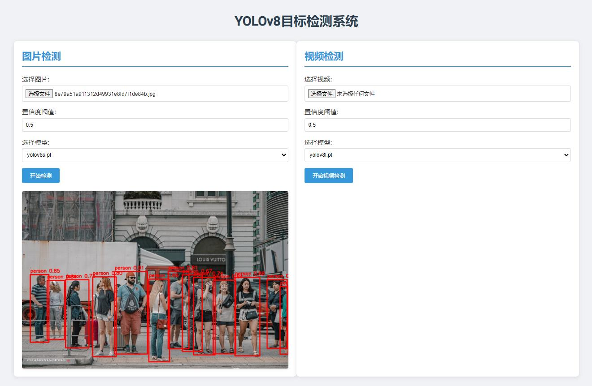

# 人体检测系统

这是一个基于YOLO模型的人体检测系统,可以处理图像和视频帧,识别并标注其中的人体。

## 功能特性

- 使用YOLO模型进行人体检测
- 支持处理单张图片和视频帧
- 可调节置信度阈值
- 在图像上绘制检测结果,包括边界框和置信度

## 安装

1. 克隆此仓库
2. 安装所需依赖:
3. pip install  -r requirements.txt

## 运行
python app.py

## 使用
1. 上传图片或视频
2. 选择模型和置信度阈值
3. 点击“检测”按钮
4. 查看检测结果

## 技术栈

- Flask: 用于构建Web应用
- OpenCV: 用于图像处理
- Ultralytics YOLO: 用于目标检测
- HTML/CSS/JavaScript: 用于前端界面

## 截图

